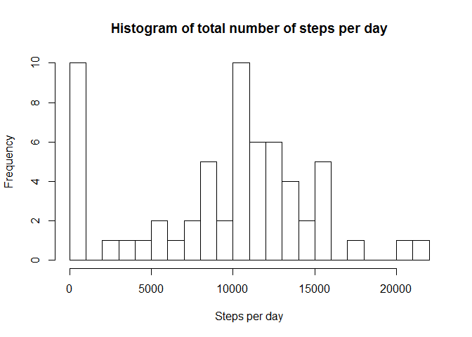
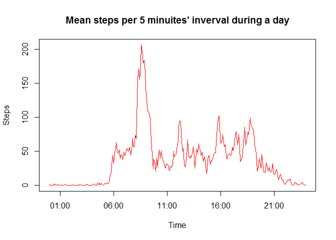
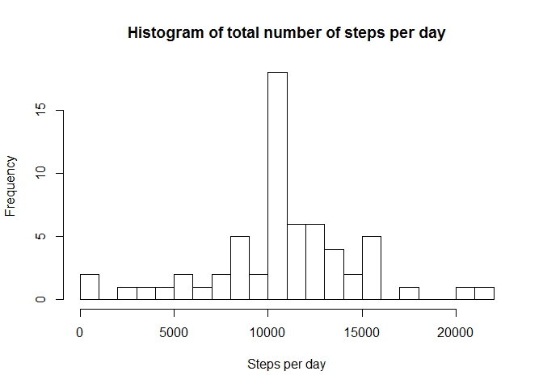
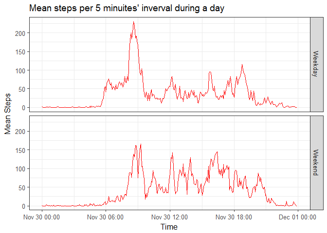

# Reproducible Research: Peer Assessment 1


## Loading and preprocessing the data
The variable 'date' is transformed to date class, and new column 'weekday'is added. I have also created a vector called 'time.vector' to store the 'interval' in formate of hour:minute:second. Note that this operation is to make sure the time-series plot has a correctly scaled x-axis. The last date of the experiment (i.e.2012-11-30) is appended to these time points to be able to generate the 'time.vector'. Again, 'time.vector' is used as x-axis in the later time-series plots about daily steps.

```r
library(dplyr)
```

```
## 
## Attaching package: 'dplyr'
```

```
## The following objects are masked from 'package:stats':
## 
##     filter, lag
```

```
## The following objects are masked from 'package:base':
## 
##     intersect, setdiff, setequal, union
```

```r
library(ggplot2)
setwd("C:/Users/Sophia/Desktop/courses/Reproducible_research/week2/RepData_PeerAssessment1")
activity<-read.csv("activity.csv", header = T, stringsAsFactors = FALSE)
```


```r
activity<-tbl_df(activity)
activity<-(activity %>% mutate(date = as.Date(date)) %>% mutate(weekday = weekdays(date)))
time.vector<-activity$interval[1:288]
output<-character()
for (i in 1:288)
{if (time.vector[i] == 0L) {output[i] <- "0000"}
    else if (time.vector[i] < 10L)          {output[i] <- paste0("000", time.vector[i])} 
        else if (time.vector[i] < 100L)     {output[i] <- paste0("00", time.vector[i])} 
            else if (time.vector[i] < 1000L) {output[i] <- paste0("0", time.vector[i])}
                else                         {output[i] <- as.character(time.vector[i])}
}
time.vector<-strptime(paste("2012-11-30", output), format = "%Y-%m-%d %H%M")
```

## What is mean total number of steps taken per day?
The mean steps per day is 9354, and the median steps per day is 10395.

```r
stepsPerDay<-summarise(group_by(activity, date), sum = sum(steps, na.rm = T))
hist(stepsPerDay$sum, breaks = 20, xlab = "Steps per day", 
     main = "Histogram of total number of steps per day")
```

<!-- -->

```r
dev.copy2pdf(file = "Hist_TotalSteps.pdf")
```

```
## png 
##   2
```

```r
dev.off()
```

```
## null device 
##           1
```

```r
summary(stepsPerDay)
```

```
##       date                 sum       
##  Min.   :2012-10-01   Min.   :    0  
##  1st Qu.:2012-10-16   1st Qu.: 6778  
##  Median :2012-10-31   Median :10395  
##  Mean   :2012-10-31   Mean   : 9354  
##  3rd Qu.:2012-11-15   3rd Qu.:12811  
##  Max.   :2012-11-30   Max.   :21194
```


## What is the average daily activity pattern?
I summarize steps of each interval aggregated across all dates, and plot the time series of such aggriegated steps by date. I determine which time interval has the highest number of steps by using the function 'which()'. The highest number of stepping is approximately 206, and occurs at 8:35 in the morning.

```r
daily<-summarize(group_by(activity, interval), steps = mean(steps, na.rm = T))
with(daily, plot(time.vector, steps, type = "l", lwd = 1.5, col = "red", xlab = 
     "Time", ylab = "Steps", main = "Mean steps per 5 minuites' inverval during a day"))
```

<!-- -->

```r
dev.copy2pdf(file = "Daily_steps_pattern.pdf")
```

```
## png 
##   2
```

```r
dev.off()
```

```
## null device 
##           1
```

```r
daily$interval[which(daily$steps == max(daily$steps))]
```

```
## [1] 835
```

```r
daily$steps[which(daily$steps == max(daily$steps))]
```

```
## [1] 206.1698
```

## Imputing missing values
The number of NAs is 2304 out of 17568 observations. I use the average steps at each interval aggregated across all dates to imput the missing data; to imput the data, function 'merge()' in dplyr package is used.  Total steps per day has been plot on an updated histogram. 
#and calculate the mean and median of the total steps per day.

```r
sum(!complete.cases(activity))
```

```
## [1] 2304
```

```r
nrow (activity) 
```

```
## [1] 17568
```

```r
missing<-activity[(!complete.cases(activity)),]
fill_missing<-tbl_df(merge(missing, daily, by = "interval"))
fill_missing<-(fill_missing %>% select(steps = steps.y, date, interval, weekday) 
               %>% arrange(date))
imput_activity<-arrange(rbind(activity[(complete.cases(activity)),], fill_missing), date)
stepsPerDay2<-summarize(group_by(imput_activity, date), sum = sum(steps))
hist(stepsPerDay2$sum, breaks = 20, xlab = "Steps per day", 
     main = "Histogram of total number of steps per day")
```

<!-- -->

```r
dev.copy2pdf(file = "Hist_filled_data_TotalSteps.pdf")
```

```
## png 
##   2
```

```r
dev.off()
```

```
## null device 
##           1
```

```r
mean(stepsPerDay2$sum)
```

```
## [1] 10766.19
```

```r
median(stepsPerDay2$sum)
```

```
## [1] 10766.19
```

## Are there differences in activity patterns between weekdays and weekends?
I lable observations with weekdays or weekends ('Weekdays.Weekends'), group the data frame based on this variable, and summrize the average steps across date within each of the group. For weekdays, the bigest peak of steps occurs in the morning around 8-9:00 am, and there are two other clear secondary peaks at around 6:00 am and 6:00 pm.  For weekends many small peaks can be seen throughout the day, and generally have lower amount of stepping compared with weekdays.  

```r
levels = levels(as.factor(imput_activity$weekday))
labels = c("Weekday", "Weekday", "Weekend", "Weekend", rep("Weekday", 3))
imput_activity<-
mutate(imput_activity, Weekdays.Weekends = factor(weekday, levels = levels,labels = labels))
```

```
## Warning in `levels<-`(`*tmp*`, value = if (nl == nL) as.character(labels)
## else paste0(labels, : duplicated levels in factors are deprecated
```

```r
weekdays<-group_by(imput_activity[(imput_activity$Weekdays.Weekends == "Weekday"),], interval)
weekends<-group_by(imput_activity[(imput_activity$Weekdays.Weekends == "Weekend"),], interval)
daily_weekdays<-summarize(weekdays, meanSteps = mean(steps), Weekdays.Weekends = "Weekday")
daily_weekends<-summarize(weekends, meanSteps = mean(steps), Weekdays.Weekends = "Weekend")
daily_weekdays$time.vector<-time.vector
daily_weekends$time.vector<-time.vector
daily2<-rbind(daily_weekdays, daily_weekends)
q<-qplot(x = time.vector, y = meanSteps, data = daily2, geom = "line", facets = Weekdays.Weekends~.,
      xlab = "Time", ylab = "Mean Steps", 
      main = "Mean steps per 5 minuites' inverval during a day",
      colour = I("red"))
q+theme_bw(base_size = 12)
```

<!-- -->

```r
dev.copy2pdf(file = "Daily_by_weekday.pdf")
```

```
## png 
##   2
```

```r
dev.off()
```

```
## null device 
##           1
```
